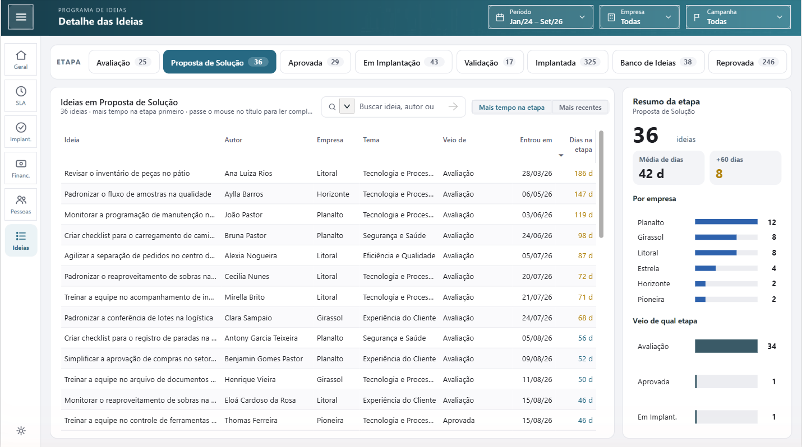
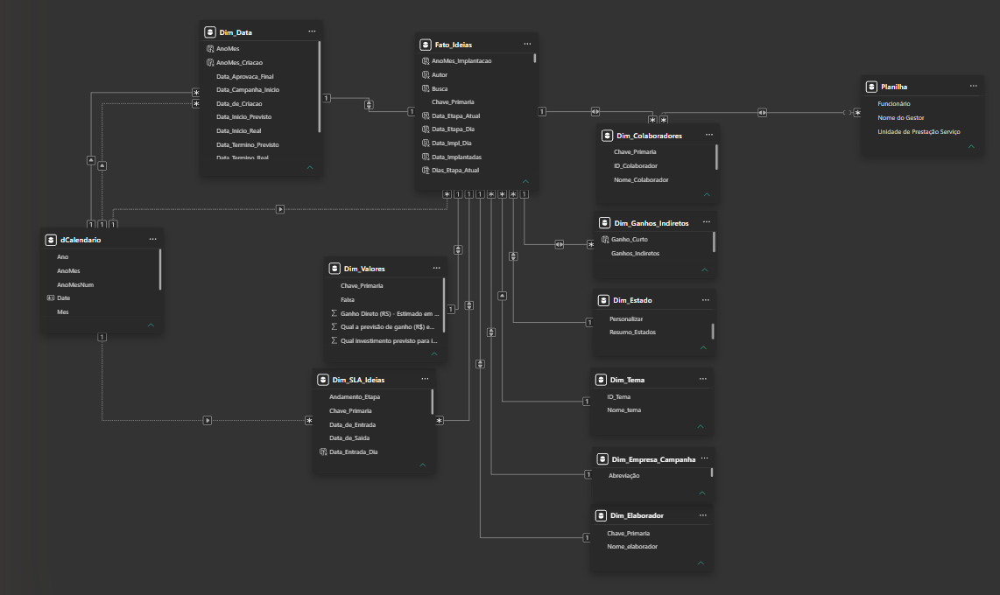
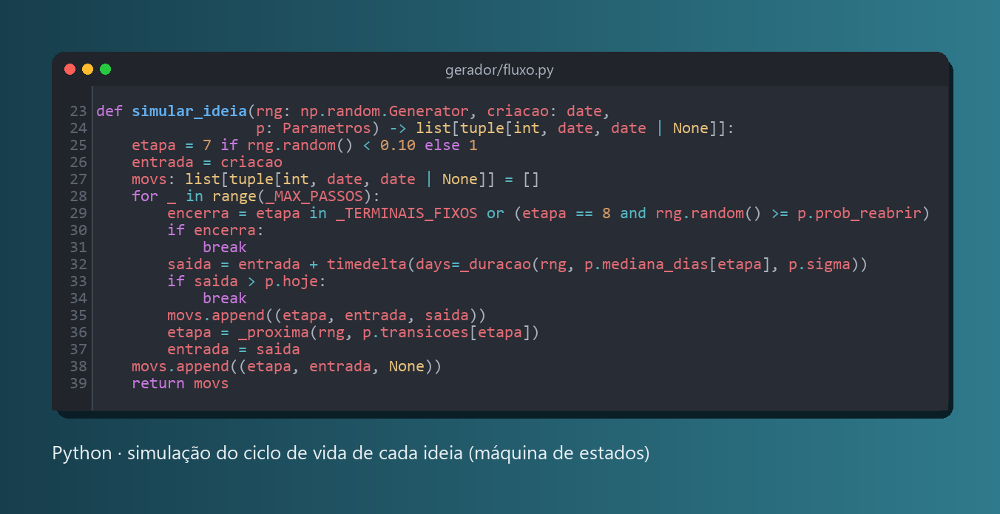
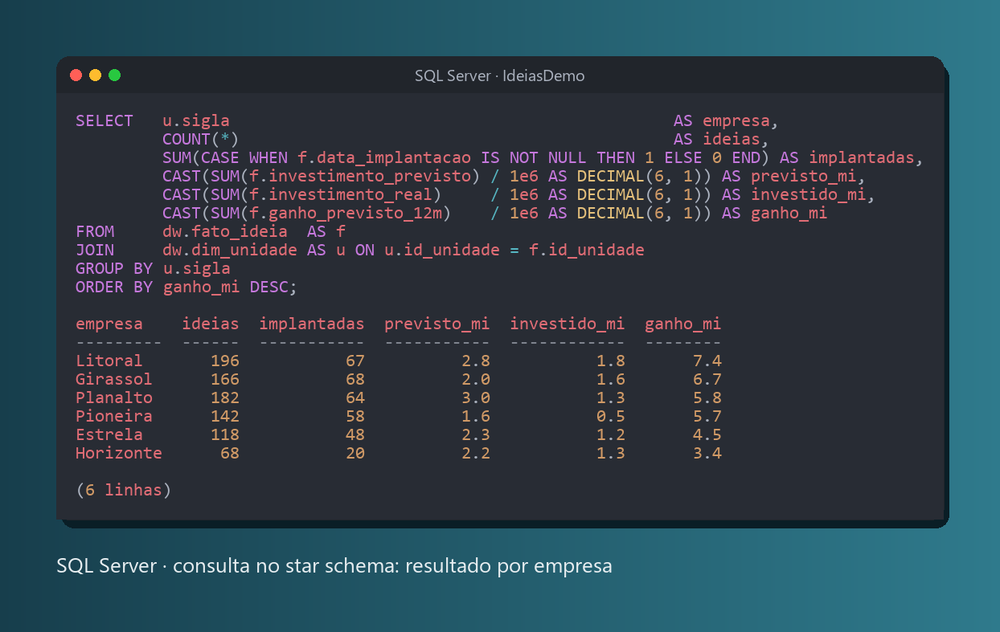

# Painel de Ideias · Python + SQL Server + Power BI

Dashboard de um programa de ideias e melhoria contínua: do cadastro da ideia até a implantação, com SLA por etapa, retorno financeiro e engajamento das pessoas.

**Todos os dados são 100% fictícios.** Pessoas, empresas, títulos, datas e valores são gerados por um simulador em Python. Nenhum dado real é usado.


## Arquitetura

```
Python (simulador)  ──▶  SQL Server · schema dw (star schema)  ──▶  schema bi (views)  ──▶  Power BI
```

| Camada | O que faz |
|---|---|
| **Python** (`gerador/`) | Simula o ciclo de vida de cada ideia como uma máquina de estados (Avaliação → Proposta → Aprovada → Em Implantação → Validação → Implantada, com reprovações e cancelamentos), gera pessoas, empresas e valores e valida tudo antes da carga. |
| **SQL Server** (`sql/`) | Star schema no schema `dw`: tabelas fato e dimensões com PK, FK, UNIQUE e CHECK nomeadas e índice em todas as chaves estrangeiras. O schema `bi` tem as views que o Power BI consome. |
| **Power BI** (`powerbi/`) | Projeto PBIP (TMDL + PBIR) com 6 páginas: Visão Geral, SLA & Fluxo, Implantadas, Financeiro, Colaboradores e Detalhe das Ideias. |

## Páginas

| SLA & Fluxo | Financeiro |
|---|---|
|  |  |

| Implantadas | Colaboradores |
|---|---|
|  |  |



## Modelo e código



| Simulação em Python | Consulta no SQL Server |
|---|---|
|  |  |

## Destaques

- **Simulação realista:** durações por etapa em distribuição lognormal, probabilidades de transição calibradas e perfil financeiro próprio por empresa (retorno e execução do orçamento).
- **Reprodutível:** a mesma `--semente` gera exatamente o mesmo banco; a data de referência fica gravada em `dw.meta_carga`, então o painel não depende de `TODAY()`.
- **Qualidade de dados:** validações em Python bloqueiam a carga se algo estiver incoerente, e `sql/04_checks.sql` confere o resultado no banco.
- **Metas definidas:** SLA geral de 60 dias, SLA por etapa, meta de engajamento de 50% e de conversão de 15%.
- **Testes:** 56 testes com `pytest` e lint com `ruff`.

## Como rodar

Requisitos: Python 3.12+, SQL Server (local, autenticação do Windows), ODBC Driver 18 e Power BI Desktop.

```bash
python -m venv .venv
.venv\Scripts\activate
pip install -r requirements.txt -r requirements-dev.txt
python -m gerador.main --sem-blocklist --semente 501844422 --data-referencia 2026-09-30
```

O comando cria o banco `IdeiasDemo`, roda `sql/01_schema.sql`, grava os dados, cria as views de `sql/03_views_compat.sql` e executa as checagens. Depois abra `powerbi/PainelIdeias.pbip` no Power BI Desktop e clique em **Atualizar**.

Opções: `--servidor` (padrão `localhost`), `--banco` (padrão `IdeiasDemo`), `--semente` e `--data-referencia` (padrão: aleatória e hoje).

Testes:

```bash
pytest
ruff check .
```

Os testes marcados com `sql` exigem o SQL Server local.

## Estrutura

```
gerador/   simulador e carga (catálogos, pessoas, fluxo, ideias, valores, validação, banco)
sql/       schema dw + views bi + checagens
powerbi/   projeto Power BI (PBIP)
tools/     religação do PBIP às views, tema visual e geração de imagens
tests/     testes automatizados
```

## Stack

Python · pandas · NumPy · Faker · SQLAlchemy · pyodbc · SQL Server 2022 · Power BI (DAX, TMDL, PBIR) · pytest · ruff
