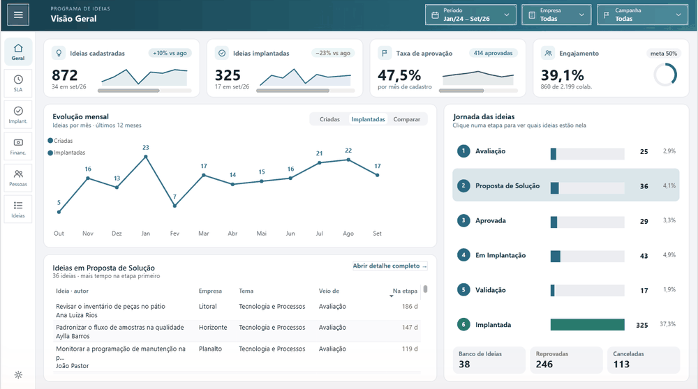
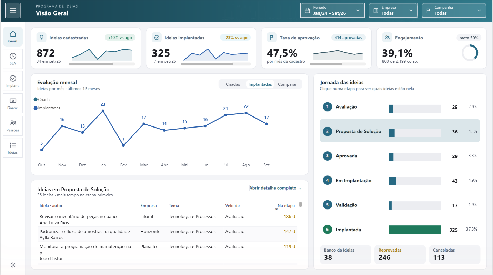
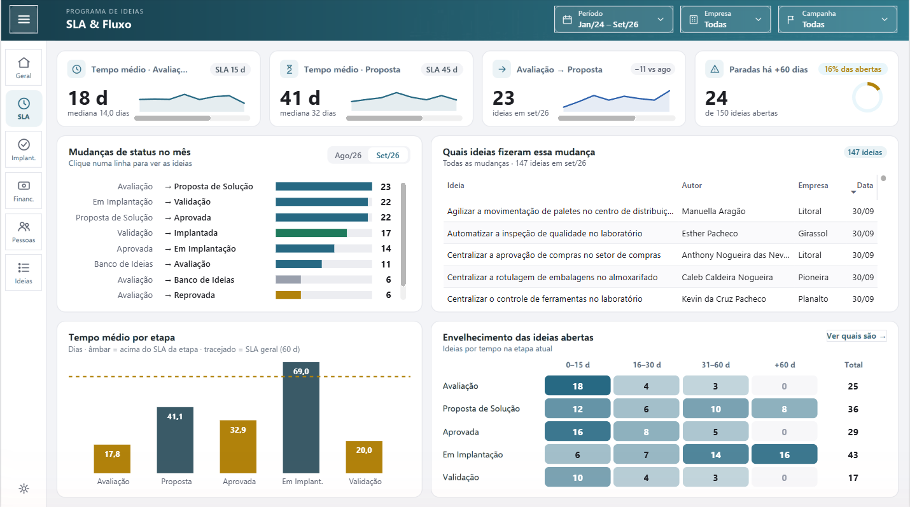
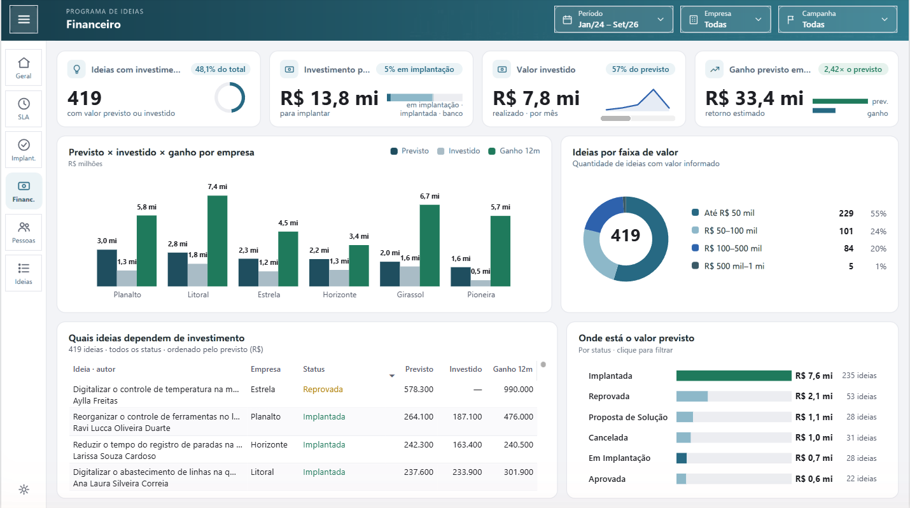
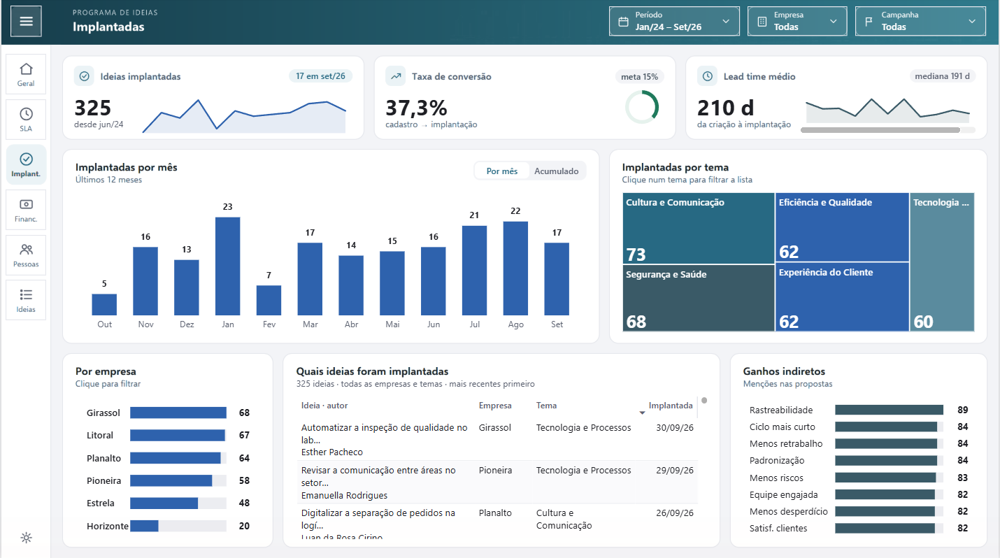
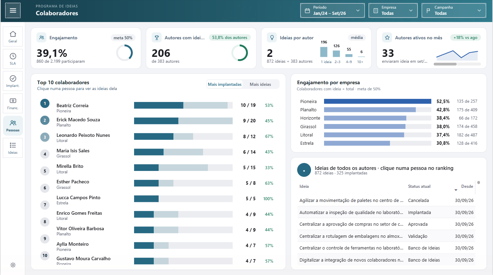

# Painel de Ideias · Python + SQL Server + Power BI

[English version](README.en.md)

> **Toda empresa tem pessoas com boas ideias. Poucas sabem o que acontece com elas depois que são enviadas.**



Este dashboard mostra o desempenho de um **programa de ideias** dentro de uma empresa, um programa que busca não só a **melhoria contínua** do dia a dia, mas também a **inovação**. Funciona assim: qualquer colaborador, do chão de fábrica ao escritório, envia sua ideia por um formulário em uma plataforma de gestão de ideias. Pode ser reduzir um desperdício, ganhar tempo num processo, deixar uma tarefa mais segura ou melhorar a experiência do cliente.

A partir daí, cada ideia percorre uma jornada:

**Avaliação → Proposta de Solução → Aprovada → Em Implantação → Validação → Implantada**

No caminho, algumas são reprovadas, outras canceladas e outras voltam para o banco de ideias para amadurecer. O problema é que essa jornada costuma ficar invisível: ninguém sabe ao certo quantas ideias estão paradas, onde elas travam, quanto dinheiro estão gerando ou quem está de fato participando.

**O painel torna essa jornada visível.** Em poucos cliques, a liderança enxerga o funil inteiro, os gargalos de prazo, o retorno financeiro e o engajamento das pessoas. Assim, o programa deixa de ser uma caixa de sugestões e passa a ser gerido com indicadores, metas e SLA.

### Perguntas que o painel responde

- **Volume e conversão:** quantas ideias entram por mês, quantas viram implantação e qual a taxa de aprovação.
- **Prazo (SLA):** quanto tempo cada ideia fica em cada etapa, quais estão acima do SLA e quais estão paradas há mais de 60 dias.
- **Fluxo:** quais mudanças de status aconteceram no mês e quais ideias andaram, travaram ou voltaram.
- **Retorno financeiro:** quanto está previsto para investir, quanto já foi investido e qual o ganho estimado em 12 meses, por empresa e por status.
- **Engajamento:** quantos colaboradores participam, quem mais contribui e como cada empresa está em relação à meta.
- **Detalhe:** a lista completa das ideias de cada etapa, com autor, empresa, tema e dias na etapa.

### O cenário simulado

- **872 ideias** de **6 empresas** e cerca de **2.200 colaboradores**, de jan/2024 a set/2026.
- Metas definidas: **SLA geral de 60 dias**, SLA por etapa (Avaliação 15 d, Proposta 45 d, Aprovada 30 d, Em Implantação 90 d, Validação 20 d), **50% de engajamento** e **15% de conversão** em implantação.
- Filtros por período, empresa e campanha em todas as páginas.

### Por que os dados são fictícios

Este painel é inspirado em um projeto real de programa de ideias. Ideias de colaboradores, nomes, valores de investimento e ganhos são **informações sensíveis**, então recriei tudo do zero com um **simulador em Python**: pessoas, empresas, títulos, datas e valores são gerados pelo simulador e gravados num SQL Server.

O simulador não sorteia números soltos. Ele reproduz o comportamento de um programa real: cada ideia percorre as etapas como uma máquina de estados, com tempo variável em cada uma, retrabalho, reprovações e cancelamentos. Cada empresa tem seu próprio perfil de retorno financeiro. O resultado é um painel com cara de dado real e **nenhum dado real** dentro dele.

## Arquitetura

```
Python (simulador)  ──▶  SQL Server · schema dw (star schema)  ──▶  schema bi (views)  ──▶  Power BI
```

| Camada | O que faz |
|---|---|
| **Python** (`gerador/`) | Simula o ciclo de vida de cada ideia como uma máquina de estados (Avaliação → Proposta → Aprovada → Em Implantação → Validação → Implantada, com reprovações e cancelamentos), gera pessoas, empresas e valores e valida tudo antes da carga. |
| **SQL Server** (`sql/`) | Star schema no schema `dw`: tabelas fato e dimensões com PK, FK, UNIQUE e CHECK nomeadas e índice em todas as chaves estrangeiras. O schema `bi` tem as views que o Power BI consome. |
| **Power BI** (`powerbi/`) | Projeto PBIP (TMDL + PBIR) com 6 páginas: Visão Geral, SLA & Fluxo, Implantadas, Financeiro, Colaboradores e Detalhe das Ideias. |

## Páginas



| SLA & Fluxo | Financeiro |
|---|---|
|  |  |

| Implantadas | Colaboradores |
|---|---|
|  |  |

## Decisões que tomei

| Decisão | Por quê |
|---|---|
| **Star schema no schema `dw` e views no schema `bi`** | Separa onde o dado é guardado de como ele é consumido. O banco segue padrão de nomes e integridade (PK, FK, CHECK); as views entregam ao Power BI exatamente as colunas que ele usa. Dá para mudar o banco sem quebrar o relatório. |
| **Simulador como máquina de estados, não linhas aleatórias** | Indicadores de SLA, envelhecimento e funil só fazem sentido se as datas e as etapas forem coerentes entre si. Cada ideia "vive" a jornada, com tempos lognormais, retrabalho e reprovações. |
| **Data de referência gravada no banco em vez de `TODAY()`** | Os números não mudam sozinhos com o calendário e não quebram na virada do mês. Junto com a `--semente`, qualquer pessoa reproduz exatamente o mesmo painel. |
| **Validar antes de carregar e checar depois** | Se algo estiver incoerente (data futura, etapa quebrada, nome duplicado), a carga para. Melhor falhar cedo do que mostrar número errado para a liderança. |
| **Metas e SLA explícitos** | Sem meta, o painel só descreve. Com SLA por etapa e metas de engajamento e conversão, ele aponta onde agir. |
| **Projeto em PBIP (TMDL + PBIR) em vez de `.pbix`** | O modelo e o relatório viram texto: versionados no Git, revisáveis linha a linha e automatizáveis por script. |
| **Segurança por linha (RLS) por empresa** | Cada empresa tem seu próprio papel de segurança, que filtra as ideias, os colaboradores e o quadro de funcionários daquela empresa. No Power BI Service, basta atribuir as pessoas ao papel da empresa delas. Testado com "Exibir como". |
| **Modelo enxuto** | Tabelas, colunas e medidas sem uso foram removidas. O modelo tem 240 medidas, todas validadas contra o banco. |

## Como foi construído

Projeto desenvolvido por mim com apoio de IA (Claude) como assistente de programação. A ideia, o desenho do processo, as regras de negócio, as metas, o layout do painel e a revisão de cada entrega são meus; a IA acelerou a escrita de código, os testes e as verificações.

## Como rodar

Requisitos: Python 3.12+, SQL Server (local, autenticação do Windows), ODBC Driver 18 e Power BI Desktop.

```bash
python -m venv .venv
.venv\Scripts\activate
pip install -r requirements.txt -r requirements-dev.txt
python -m gerador.main --sem-blocklist --semente 501844422 --data-referencia 2026-09-30
```

O comando cria o banco `IdeiasDemo`, roda `sql/01_schema.sql`, grava os dados, cria as views de `sql/03_views_compat.sql` e executa as checagens. Depois rode `python tools/religar_pbip.py --rls` para criar um papel de segurança por empresa, abra `powerbi/PainelIdeias.pbip` no Power BI Desktop e clique em **Atualizar**.

Opções: `--servidor` (padrão `localhost`), `--banco` (padrão `IdeiasDemo`), `--semente` e `--data-referencia` (padrão: aleatória e hoje).

Testes:

```bash
pytest
ruff check .
```

Os testes marcados com `sql` exigem o SQL Server local.

## Estrutura

```
gerador/   simulador e carga (catálogos, pessoas, fluxo, ideias, valores, validação, banco)
sql/       schema dw + views bi + checagens
powerbi/   projeto Power BI (PBIP)
tools/     religação do PBIP às views, tema visual e geração de imagens
tests/     testes automatizados
```

## Stack

<p>
  
  
  
  
  
  
  
</p>
